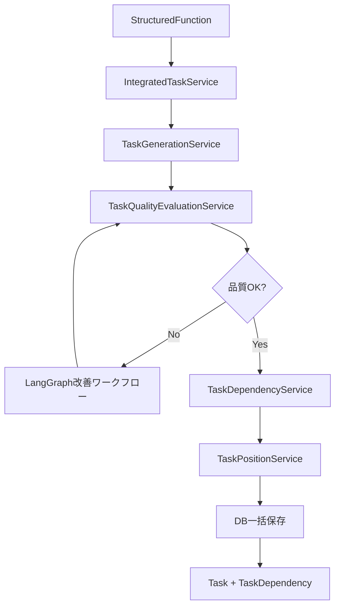

# 全体設計分析レポート - 移行計画を考慮した再評価

**作成日**: 2025-10-09
**目的**: 現在進行中の移行計画（機能構造化 → タスク生成）とハンズオン生成エージェント計画を踏まえた、全体アーキテクチャの分析と整理

---

## 🎯 移行計画の理解

### 現在のワークフロー設計

```
1. プロジェクト作成
   ↓
2. アイデアからQ&A生成 (/api/question)
   ↓
3. Q&Aから要約・仕様書生成 (/api/summary)
   ↓
4. 機能要件生成 (/api/function_requirements)
   ↓
5. 機能構造化 (/api/function_structuring) ← **ReActエージェント**
   ↓ [StructuredFunction + FunctionDependency テーブルに保存]
   ↓
6. ✨ 完全タスク生成 (/api/complete_task_generation)
   │  ├─ タスク生成 (task_generation_service)
   │  ├─ 品質評価 (task_quality_evaluation_service)
   │  ├─ 品質改善 (LangGraphワークフロー)
   │  ├─ 依存関係生成 (task_dependency_service)
   │  └─ ReactFlow座標計算 (task_position_service)
   ↓ [Task + TaskDependency テーブルに保存]
   ↓
7. 🔮 タスク詳細ハンズオン生成 ← **今後実装予定**
   └─ 各タスクに具体的な実装手順を生成
```

---

## 📊 設計の3つのフェーズ

### Phase 1: レガシーアーキテクチャ（旧設計）
**特徴**: 単発AIサービスの集合体

| ルーター | 説明 | 状態 |
|---------|------|------|
| `directory.py` | ディレクトリ構造生成 | ❌ 未使用（レガシー） |
| `environment.py` | 環境構築ハンズオン | ❌ 未使用（レガシー） |
| `deploy.py` | デプロイ設定生成 | ❌ 未使用（レガシー） |
| `tasks.py` | ReactFlowグラフ変換 | ❌ 未使用（レガシー） |
| `taskDetail.py` | タスク詳細並列生成 | ❌ 未使用（レガシー） |
| `taskChat.py` | 開発支援AIチャット | ❌ 未使用（レガシー） |
| `graphTask.py` | タスク依存関係グラフ | ❌ 未使用（レガシー） |
| `durationTask.py` | タスク作業期間算出 | ❌ 未使用（レガシー） |

**問題点**:
- 機能が散在し、統合されていない
- タスク管理が一貫していない
- 品質保証の仕組みがない

---

### Phase 2: 移行中アーキテクチャ（現在）
**特徴**: 機能構造化ベースの統合タスク生成システム

#### 🏗️ 中核サービス（実装済み、FE未接続）

| サービス | ファイル | 役割 | 状態 |
|---------|---------|------|------|
| **統合タスク生成** | `integrated_task_service.py` | 全体オーケストレーション | ✅ 実装完了 |
| **タスク生成** | `task_generation_service.py` | 機能からタスク生成（バッチ処理） | ✅ 実装完了 |
| **品質評価** | `task_quality_evaluation_service.py` | 2軸品質評価（Layer/Domain） | ✅ 実装完了 |
| **依存関係生成** | `task_dependency_service.py` | タスク間依存関係の自動生成 | ✅ 実装完了 |
| **座標計算** | `task_position_service.py` | ReactFlow表示用座標計算 | ✅ 実装完了 |

#### 📡 APIエンドポイント（実装済み、FE未接続）

```python
# complete_task_generation.py
POST /api/complete_task_generation/generate_complete
  → 1回の呼び出しで全処理を実行:
     1. 機能からタスク生成
     2. 品質評価
     3. 品質改善（LangGraphワークフロー、最大3イテレーション）
     4. 依存関係生成
     5. ReactFlow座標計算
     6. DB一括保存（Task + TaskDependency）

GET /api/complete_task_generation/preview/{project_id}
  → タスク生成のプレビュー（DB保存なし）

DELETE /api/complete_task_generation/clear/{project_id}
  → 生成タスククリア（開発用）
```

```python
# task_generation.py（単体テスト・デバッグ用）
POST /api/task_generation/generate
GET /api/task_generation/status/{project_id}
GET /api/task_generation/tasks/{project_id}
DELETE /api/task_generation/tasks/{project_id}
POST /api/task_generation/batch-test
```

```python
# task_quality.py（単体テスト・デバッグ用）
POST /api/task_quality/evaluate
POST /api/task_quality/improve
GET /api/task_quality/status/{project_id}
GET /api/task_quality/issues/{project_id}
DELETE /api/task_quality/cache/{project_id}
```

#### 🔄 処理フロー詳細



**品質評価の2軸**:
1. **Layer（技術層内整合性）**: DB設計 → バックエンド → フロントエンド の一貫性
2. **Domain（ドメイン完結性）**: 認証、データ管理などドメイン機能の完全性

---

### Phase 3: 目標アーキテクチャ（将来）
**特徴**: タスク詳細ハンズオン生成エージェントの追加

```
Task (生成済み)
  ↓
タスク詳細ハンズオンエージェント ← **これから実装**
  ├─ environment_service（環境構築）を再利用？
  ├─ directory_service（ディレクトリ構造）を再利用？
  └─ 新しいハンズオン生成ロジック
  ↓
Task.detail フィールドに保存
```

**想定される実装方針**:
- レガシーサービスの **一部ロジックを再利用** しつつ、新しいエージェントに統合
- タスク単位で具体的な実装手順を生成（コード例、設定ファイル、コマンド等）
- `Task.detail` フィールドに保存

---

## 🗄️ データベーステーブルの役割再評価

### ✅ コアテーブル（絶対に必要）

| テーブル | 役割 | 使用箇所 | 備考 |
|---------|------|----------|------|
| **member** | メンバー管理 | FE全体 | 基本情報 |
| **projectBase** | プロジェクト基本情報 | FE全体 | 基本情報 |
| **projectDocument** | 仕様書・フレームワーク・ディレクトリ | Q&A〜機能構造化 | 重要 |
| **projectMember** | プロジェクト-メンバー多対多 | タスク割当 | 必須 |
| **qa** | Q&A管理 | Q&A生成〜要約 | 必須 |
| **env** | 環境設定情報 | 環境構築 | 必須 |

### ✅ 機能構造化テーブル（移行後の中核）

| テーブル | 役割 | 使用箇所 | 備考 |
|---------|------|----------|------|
| **structured_functions** | 構造化された機能情報 | 機能構造化 → タスク生成 | **Phase 2の中核** |
| **function_dependencies** | 機能間依存関係 | 機能構造化 | **Phase 2の中核** |
| **function_to_task_mapping** | 機能-タスクマッピング | タスク生成時に自動生成 | **重要（トレーサビリティ）** |

### ✅ タスク管理テーブル（移行後の中核）

| テーブル | 役割 | 使用箇所 | 備考 |
|---------|------|----------|------|
| **task** | タスク情報（ReactFlow用フィールド含む） | タスク生成 → 実行管理 | **Phase 2の中核** |
| **task_dependencies** | タスク間依存関係（ReactFlow Edge） | complete_task_generation | **Phase 2で自動生成** |
| **taskAssignment** | タスク割当（M:N） | タスク実行管理 | 必須 |

### ❌ 削除候補テーブル

| テーブル | 理由 | 削除優先度 |
|---------|------|----------|
| **aiDocument** | APIが存在せず完全に未使用 | 🔴 高（即削除可） |

---

## 🔍 APIエンドポイントの再分類

### ✅ 必須（Phase 2で使用中またはFEで使用中）

#### DB CRUD系（47個）
- Member: 7個（GitHub nameベースの2個を除く）
- Project: 6個（全て必須）
- ProjectDocument: 5個（project_idベース、doc_idベースは削除可）
- ProjectMember: 6個（全て必須）
- Env: 7個（全て必須）
- Task: 7個（全て必須）
- TaskAssignment: 8個（全て必須）
- QA: 6個（全て必須）

#### AIサービス系（37個）
- Q&A Generation: 2個 ✅
- Summary: 5個 ✅（update-qa-and-regenerateは削除可）
- Framework: 7個 ✅
- Technology: 3個 ✅
- Function Requirements: 7個 ✅
- Function Structuring: 6個 ✅
- **Complete Task Generation: 3個** 🔜 **Phase 2で使用予定**
- **Task Generation: 5個** 🔧 **デバッグ用（Phase 2開発中）**
- **Task Quality: 5個** 🔧 **デバッグ用（Phase 2開発中）**

**小計: 84個（Phase 2移行後）**

---

### 🔄 レガシー（将来的にロジック再利用の可能性）

#### Phase 3ハンズオン生成で再利用予定

| エンドポイント | サービス | 再利用可能性 | アクション |
|-------------|---------|------------|----------|
| `POST /api/directory/` | `directory_service.py` | 🟡 中 | **保留（ロジック再利用検討）** |
| `POST /api/environment/` | `environment_service.py` | 🟢 高 | **保留（ロジック再利用有力）** |
| `POST /api/taskDetail/` | `taskDetail_service.py` | 🟡 中 | **保留（並列処理パターン参考）** |

#### Phase 3で統合予定（削除候補）

| エンドポイント | 理由 | アクション |
|-------------|------|----------|
| `POST /api/deploy/` | デプロイ設定は環境構築に統合可能 | 🔶 **要検討** |
| `POST /api/taskChat/` | タスク支援チャットは別機能として残す可能性 | 🔶 **要検討** |
| `POST /api/graphTask/` | 依存関係はcomplete_task_generationで自動生成 | 🔴 **削除候補** |
| `POST /api/durationTask/` | 期間算出はtask_generation内で実装済み | 🔴 **削除候補** |
| `POST /api/get_object_and_tasks/` | ReactFlow変換は不要（新設計で自動化） | 🔴 **削除候補** |

---

### ❌ 即削除可能（レガシー、使用予定なし）

なし（Phase 3での再利用可能性を考慮し、すべて保留または要検討に分類）

---

## 🎯 推奨アクション（修正版）

### Phase 1: 即実施可能（安全な削除）

#### 1. DBテーブル削除
```python
# back/models/project_base.py から削除
class AIDocument(Base):  # ← 完全に未使用
```

#### 2. 副次的CRUDエンドポイント削除（5個）
- `PUT /member/github/{github_name}`
- `DELETE /member/github/{github_name}`
- `GET /project_document/id/{doc_id}`
- `PUT /project_document/id/{doc_id}`
- `DELETE /project_document/id/{doc_id}`

**理由**: IDベースのエンドポイントで代替可能

#### 3. 統合済みエンドポイント削除（3個）
- `POST /api/get_object_and_tasks/` (tasks.py)
- `POST /api/graphTask/` (graphTask.py)
- `POST /api/durationTask/` (durationTask.py)
- `POST /api/summary/update-qa-and-regenerate` (summary.py)

**理由**: complete_task_generationで統合済み

---

### Phase 2: 検討後実施（慎重に判断）

#### 4. レガシーサービスの扱い（保留）

**🟢 保持推奨（Phase 3で再利用可能性高）**:
```python
# 保持するサービスとルーター
back/services/environment_service.py     # 環境構築ハンズオン生成
back/routers/environment.py

back/services/directory_service.py       # ディレクトリ構造生成
back/routers/directory.py

back/services/taskDetail_service.py      # 並列処理パターン
back/routers/taskDetail.py
```

**理由**:
- `environment_service`: Phase 3のタスク詳細ハンズオン生成で**高確率で再利用**
- `directory_service`: プロジェクト初期設定で有用
- `taskDetail_service`: 並列処理のベストプラクティスとして参考になる

**🔶 要検討（ビジネス要件次第）**:
```python
back/services/deploy_service.py          # デプロイ設定
back/routers/deploy.py

back/services/taskChat_service.py        # 開発支援チャット
back/routers/taskChat.py
```

**理由**:
- `deploy_service`: デプロイ自動化が必要なら残す
- `taskChat_service`: リアルタイム支援機能が必要なら独立させる

---

### Phase 3: 移行完了後（FE接続完了後に実施）

#### 5. デバッグ用エンドポイントの整理

```python
# Phase 2開発完了後、本番環境では無効化を検討
POST /api/task_generation/batch-test      # テスト専用
DELETE /api/task_generation/tasks/{id}    # デバッグ専用
DELETE /api/task_quality/cache/{id}       # デバッグ専用
DELETE /api/complete_task_generation/clear/{id}  # デバッグ専用
```

**アクション**:
- 開発環境のみ有効化
- 本番では環境変数で無効化

---

## 📐 移行後の最終アーキテクチャ（Phase 2完了時）

### ワークフロー

```
1. プロジェクト作成
   ↓
2. Q&A生成 → 要約・仕様書 → 機能要件
   ↓
3. 機能構造化（ReActエージェント）
   ↓ [StructuredFunction + FunctionDependency]
   ↓
4. 完全タスク生成（統合サービス）← **FE接続予定**
   │
   ├─ タスク生成（バッチ処理）
   ├─ 品質評価（2軸並列評価）
   ├─ 品質改善（LangGraphワークフロー）
   ├─ 依存関係生成
   └─ ReactFlow座標計算
   ↓ [Task + TaskDependency + FunctionToTaskMapping]
   ↓
5. タスク実行管理（TaskAssignment）
   ↓
6. [Phase 3] タスク詳細ハンズオン生成 ← **将来実装**
```

### APIエンドポイント構成（Phase 2完了後）

| カテゴリ | エンドポイント数 | 備考 |
|---------|----------------|------|
| **DB CRUD** | 47個 | 副次的エンドポイント削除後 |
| **AI Core** | 30個 | Q&A, Summary, Framework, Technology, Function Requirements, Function Structuring |
| **Task Generation** | 13個 | Complete Task Generation (3) + Task Generation (5) + Task Quality (5) |
| **レガシー保留** | 3個 | Directory, Environment, TaskDetail（Phase 3で再利用） |
| **要検討** | 2個 | Deploy, TaskChat（ビジネス要件次第） |
| **合計** | **95個** | 削除: 17個（112 → 95） |

---

## 🗂️ ファイル構成整理

### 削除推奨ファイル（Phase 1）

```bash
# DB
back/models/project_base.py の AIDocument クラス

# ルーター（4個）
back/routers/tasks.py           # ReactFlow変換（統合済み）
back/routers/graphTask.py       # 依存関係グラフ（統合済み）
back/routers/durationTask.py    # 期間算出（統合済み）

# サービス（3個）
back/services/tasks_service.py
back/services/graphTask_service.py
back/services/durationTask_service.py
```

### 保留ファイル（Phase 2〜3）

```bash
# 再利用可能性が高い
back/routers/directory.py
back/routers/environment.py
back/routers/taskDetail.py
back/services/directory_service.py
back/services/environment_service.py
back/services/taskDetail_service.py

# ビジネス要件次第
back/routers/deploy.py
back/routers/taskChat.py
back/services/deploy_service.py
back/services/taskChat_service.py
```

### Phase 2の中核ファイル（保持必須）

```bash
# 統合タスク生成システム
back/routers/complete_task_generation.py  # 統合API
back/routers/task_generation.py           # タスク生成API（デバッグ用）
back/routers/task_quality.py              # 品質評価API（デバッグ用）

back/services/integrated_task_service.py         # オーケストレーター
back/services/task_generation_service.py         # タスク生成
back/services/task_quality_evaluation_service.py # 品質評価・改善
back/services/task_dependency_service.py         # 依存関係生成
back/services/task_position_service.py           # 座標計算

# 機能構造化（ReActエージェント）
back/routers/function_structuring.py
back/services/function_structuring_service.py
```

---

## 📊 削減効果（修正版）

### Phase 1実施後

| 項目 | 削除前 | 削除後 | 削減数 |
|-----|--------|--------|--------|
| **APIエンドポイント** | 112個 | 104個 | -8個 |
| **ルーターファイル** | 24個 | 20個 | -4個 |
| **サービスファイル** | 23個 | 20個 | -3個 |
| **DBテーブル** | 11個 | 10個 | -1個 |

### Phase 3実施後（最終形態）

| 項目 | 削除前 | 削除後 | 削減数 |
|-----|--------|--------|--------|
| **APIエンドポイント** | 112個 | 95個 | -17個 |
| **ルーターファイル** | 24個 | 17個 | -7個 |
| **サービスファイル** | 23個 | 16個 | -7個 |

---

## 🎯 次のステップ

### 即実施（Phase 1）
1. ✅ AIDocument テーブル削除
2. ✅ 副次的CRUDエンドポイント削除（5個）
3. ✅ 統合済みルーター削除（tasks, graphTask, durationTask）

### FE実装（Phase 2）
4. 🔜 `POST /api/complete_task_generation/generate_complete` のFE接続
5. 🔜 タスク生成プレビュー機能の実装
6. 🔜 ReactFlowでのタスク依存関係表示

### Phase 3計画
7. 🔮 タスク詳細ハンズオン生成エージェント設計
8. 🔮 environment_service / directory_service の再利用検討
9. 🔮 レガシーサービスの統合・リファクタリング

---

**レポート作成者**: Claude Code
**最終更新**: 2025-10-09
