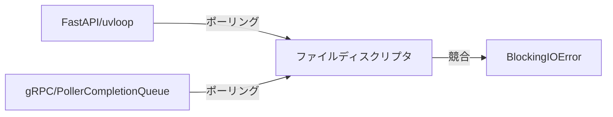

# gRPC/uvloop競合エラー調査レポート

**日付**: 2025-01-19
**エラー**: `BlockingIOError: [Errno 11] Resource temporarily unavailable`
**状態**: 修正完了（要再起動）

---

## 📌 エラー概要

```
Exception in callback PollerCompletionQueue._handle_events
BlockingIOError: [Errno 11] Resource temporarily unavailable
```

このエラーは、Google Gemini APIとの通信で使用されるgRPCライブラリと、FastAPIのデフォルト非同期イベントループ（uvloop）との間で発生する競合問題です。

---

## 🔍 根本原因

### 1. 技術的背景

| コンポーネント | 使用技術 | 役割 |
|--------------|---------|------|
| **FastAPI** | uvloop | 高速な非同期イベントループ（デフォルト） |
| **Google Gemini API** | gRPC | Google APIとの通信プロトコル |
| **langchain-google-genai** | grpcio | gRPCクライアントライブラリ |

### 2. 競合のメカニズム



1. **uvloop**と**gRPC**が同時にファイルディスクリプタ（ソケット）をポーリング
2. 両方のイベントループが同じリソースにアクセスしようとして競合
3. `BlockingIOError: Resource temporarily unavailable` (EAGAIN) が発生

### 3. 発生箇所

| ファイル | 行数 | 説明 |
|---------|------|------|
| `back/services/base_service.py` | 107-111 | `ChatGoogleGenerativeAI`の初期化時 |
| `back/routers/summary.py` | 98 | `MVPJudgeService`がGemini APIを呼び出す時 |
| `back/services/mvp_judge_service.py` | 44-51 | AI判定処理の実行時 |

---

## ✅ 実装した修正

### 修正1: back/app.py

**変更内容**:
```python
import os

# gRPCとuvloopの競合を回避するための環境変数設定
os.environ["GRPC_POLL_STRATEGY"] = "poll"
os.environ["GRPC_ENABLE_FORK_SUPPORT"] = "1"

from fastapi import FastAPI
from fastapi.middleware.cors import CORSMiddleware
```

**効果**:
- `GRPC_POLL_STRATEGY=poll`: gRPCのポーリング戦略を標準の`poll()`システムコールに変更（uvloopとの競合を回避）
- `GRPC_ENABLE_FORK_SUPPORT=1`: フォークプロセス環境でのgRPC処理を安定化

**参照**: back/app.py:1-5

---

### 修正2: .devcontainer/docker-compose.yml

**backendサービス**:
```yaml
backend:
  environment:
    - DATABASE_URL=postgresql://hack_helper:hackathon@db/hackathon_support_agent
    - REDIS_URL=redis://redis:6379/0
    - GRPC_POLL_STRATEGY=poll          # 追加
    - GRPC_ENABLE_FORK_SUPPORT=1       # 追加
```

**celery-workerサービス**:
```yaml
celery-worker:
  environment:
    - DATABASE_URL=postgresql://hack_helper:hackathon@db/hackathon_support_agent
    - REDIS_URL=redis://redis:6379/0
    - GRPC_POLL_STRATEGY=poll          # 追加
    - GRPC_ENABLE_FORK_SUPPORT=1       # 追加
```

**理由**: Dockerコンテナ内でも同じ環境変数が必要

**参照**: .devcontainer/docker-compose.yml:23-24, 80-81

---

## 🔧 追加調査: 追加質問の回答が空の件

### 問題の報告

「追加質問の回答が自動入力されていない」

### 調査結果

これは**仕様通りの動作**です：

#### 1. AIは質問のみを生成

**プロンプト設定** (back/services/prompts.toml:654, 662):
```json
{
  "question": "利用シナリオ1で、ユーザーが「検索する」とありますが...",
  "importance": 5,
  "is_ai": true,
  "project_id": null,
  "answer": null  // ← 常にnull
}
```

**実装箇所** (back/services/mvp_judge_service.py:77):
```python
"answer": qa.get("answer") if qa.get("answer") not in ("", None) else None,
```

#### 2. 評価が高い場合は質問自体が生成されない

**判定ロジック** (back/services/mvp_judge_service.py:63-67):
```python
is_pass = (j.mvp_feasible and j.score_0_100 >= PASS)

if is_pass and j.confidence >= CONF_T:
    action = True
    return_qa = []  # ← 空の配列を返す
```

**条件**:
- スコア75点以上
- 信頼度0.7以上

→ 追加質問は生成されない（十分な情報があると判断）

### デバッグログの追加

**ファイル**: front/src/app/hackSetUp/[ProjectId]/summaryQA/page.tsx:49-62

```typescript
console.log("=== 評価結果の詳細 ===");
console.log("評価結果全体:", evaluation);
console.log("スコア:", evaluation.score_0_100);
console.log("MVP可能性:", evaluation.mvp_feasible);
console.log("信頼度:", evaluation.confidence);
console.log("追加質問の数:", evaluation.qa?.length || 0);
console.log("追加質問の内容:", evaluation.qa);
```

ブラウザコンソール（F12）で実際のデータを確認可能。

---

## 🚀 次のステップ

### 必須: バックエンドの再起動

```bash
# プロジェクトルートで実行
docker compose -f .devcontainer/docker-compose.yml restart backend celery-worker
```

または

```bash
# コンテナを完全に再ビルドする場合
docker compose -f .devcontainer/docker-compose.yml down
docker compose -f .devcontainer/docker-compose.yml up -d --build backend celery-worker
```

### 動作確認

1. **gRPCエラーの確認**
   ```bash
   docker compose -f .devcontainer/docker-compose.yml logs -f backend
   ```
   - `BlockingIOError`が消えていることを確認

2. **フロントエンドでの確認**
   - ブラウザでアプリにアクセス
   - F12でコンソールを開く
   - 「評価結果の詳細」ログを確認
   - 追加質問の数とスコアを確認

3. **動作テスト**
   - プロジェクト作成フロー
   - 要約生成（`/api/summary/evaluate`）
   - 追加質問の表示

---

## 📝 オプション: 追加質問の仕様変更

もしAIに**回答例も生成させたい**場合は、以下を修正する必要があります：

### 修正箇所1: back/services/prompts.toml

**現在** (654行目):
```json
"answer": null
```

**変更後**:
```json
"answer": "推奨される回答例をここに記載"
```

プロンプトに以下を追加：
```
各質問には以下を含めてください：
- question: ユーザーへの質問文
- answer: 推奨される回答例（具体的に）
- importance: 1から5の整数（5が最重要）
```

### 修正箇所2: back/services/mvp_judge_service.py

不要（プロンプトから回答が返ってくるため）

---

## 📚 参考資料

### gRPC環境変数の詳細

| 環境変数 | 値 | 効果 |
|---------|---|------|
| `GRPC_POLL_STRATEGY` | `poll` | 標準のpoll()を使用（epoll/kqueue回避） |
| `GRPC_ENABLE_FORK_SUPPORT` | `1` | フォーク後のgRPC安定化 |
| `GRPC_VERBOSITY` | `DEBUG` | デバッグログ（必要時のみ） |

### 関連ドキュメント

- [gRPC Environment Variables](https://github.com/grpc/grpc/blob/master/doc/environment_variables.md)
- [uvloop Documentation](https://uvloop.readthedocs.io/)
- [FastAPI with gRPC](https://github.com/tiangolo/fastapi/discussions/4719)

---

## 📊 影響範囲

### 修正前の影響

- ✅ **GET/POST APIは正常動作**（データベースCRUDなど）
- ❌ **AI機能でエラー発生**（Gemini API使用箇所）
  - 要約生成
  - MVP判定
  - 追加質問生成
  - タスク生成
  - その他AIサービス

### 修正後の期待結果

- ✅ **全APIが正常動作**
- ✅ **gRPCエラーが消失**
- ✅ **パフォーマンス低下なし**（poll戦略は十分高速）

---

## 🔖 変更ファイル一覧

| ファイル | 変更内容 | 行数 |
|---------|---------|------|
| `back/app.py` | gRPC環境変数の設定 | 1-5 |
| `.devcontainer/docker-compose.yml` | backend環境変数追加 | 23-24 |
| `.devcontainer/docker-compose.yml` | celery-worker環境変数追加 | 80-81 |
| `front/src/app/hackSetUp/[ProjectId]/summaryQA/page.tsx` | デバッグログ追加 | 49-62 |
| `front/src/components/QASection/QASection.tsx` | textarea高さ自動調整 | 31-35, 260-276, 360-381 |

---

## ✨ まとめ

1. **gRPCエラーの原因**: uvloopとの非同期イベントループ競合
2. **修正方法**: 環境変数でgRPCのポーリング戦略を変更
3. **追加質問の仕様**: AIは質問のみ生成（回答はユーザー入力想定）
4. **必要なアクション**: バックエンドコンテナの再起動

**ステータス**: 修正完了 ✅（再起動待ち）

---

**レポート作成日**: 2025-01-19
**作成者**: Claude Code
**バージョン**: 1.0
