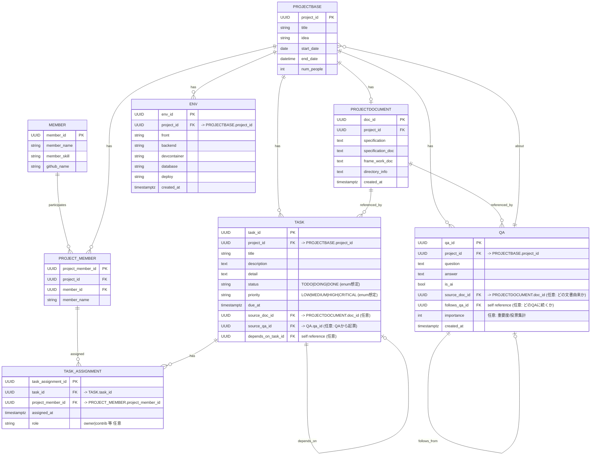

- 技術選定の部分はAIが選んでくれた方が圧倒的にUXとしていいな。これとこれがいいですよと推薦してくれる感じだとなおよい。
そう考えるとここの部分は小さなモデルを使ってもよい。先に十分な量の選択を用意していて、AIが推薦してくれた奴が不服なら自分で選びなおすることが出来るような設計にしたほうが筋がいいきがする

#  要件定義書

1. 最初のページ : アイディアと期間とプロジェクトタイトルなどを設定する。 
2. QAセッションを行う。オープンなクエッションを用いていいものを作る。QAセッションでメンターの方や上級者からプラスする。 
3. 第一の要件定義書を作る。（MVP)に特化する。（よりどのような状況なのか？みたいな最終的に提供する価値などを定義する。） 
4. その後に機能要件を作る。(どのような機能が必要かどうかを作る）（機能を要件定義から作る） 
5. その後に実装のための技術を生成する。 
6. 技術を実装するための技術を考える。 
7. タスクを全て生成する。 
8. 技術選定とその技術の環境構築を生成する。 
9. 開発タスクを全体的に考えてどのような順番でそのアプリを実装するかをグラフ的に見せる。 
10. タスクの一覧を見せる。タスクを看板ボードとして見せる。
11. AIサポートの導入（QAファシリテーション、技術選定、タスク優先度付け）
12. ビジュアル要素の追加（マインドマップ、依存関係グラフ、ガントチャート切り替え）
13. ハッカソンらしい時間圧縮支援（カウントダウン、簡易テンプレート、即時アドバイス）

